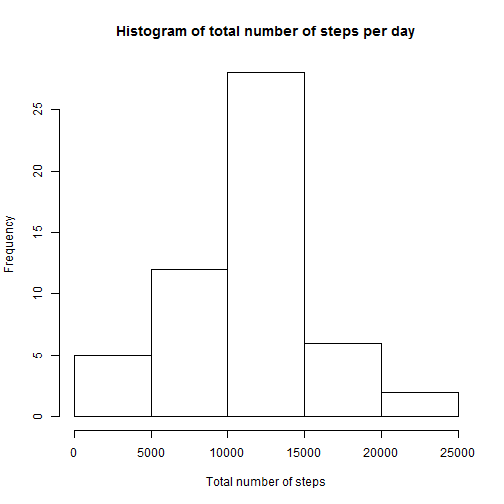
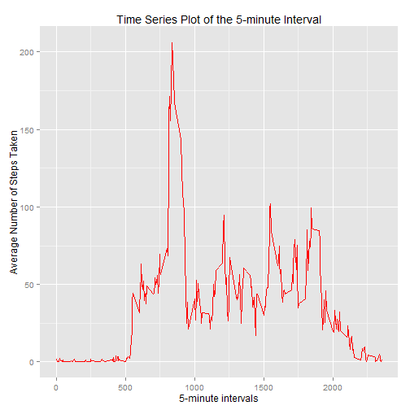
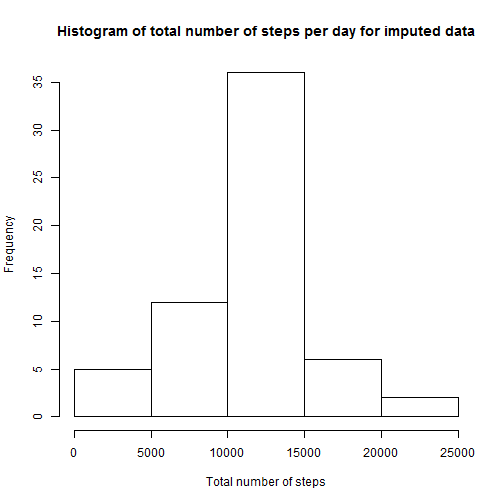

Reproducible Research : Peer Assessment 1
-------------------------------

### - Loading and preprocessing the data


```r
setwd("~/Coursera/Data_Science_Specialization/Reproducible_Research/Working_Directory/Peer_Assessment_1")
##getwd()
##Load the data (i.e. read.csv())
unzip("repdata-data-activity.zip")
activity_data <- read.csv("activity.csv",colClasses = c("integer","Date","integer"))
```

### - What is mean total number of steps taken per day?

#### * Calculate the total number of steps taken per day


```r
#removing records with missing values
act_data_non_miss <- na.omit(activity_data)
rownames(act_data_non_miss) <- 1:nrow(act_data_non_miss)

total_steps <- aggregate(act_data_non_miss$steps, list(Date = act_data_non_miss$date), FUN = "sum")
names(total_steps)[2] <- "Total_Steps"
```


#### * Make a histogram of the total number of steps taken each day


```r
##Histogram
hist(total_steps$Total_Steps, main = paste("Histogram of total number of steps per day"), xlab = paste("Total number of steps"))
```

 

#### * Calculate and report the mean and median of the total number of steps taken per day


```r
mean_total_steps <- mean(total_steps$Total_Steps)
median_total_steps <- median(total_steps$Total_Steps)
```

##### The mean of total number of steps per day is 1.0766189 &times; 10<sup>4</sup>
##### The median of total number of steps per day is 10765

### - What is the average daily activity pattern?

#### * Make a time series plot (i.e. type = "l") of the 5-minute interval (x-axis) and the average number of steps taken, averaged across all days (y-axis)


```r
library(ggplot2)

average_steps <- aggregate(act_data_non_miss$steps, list(Interval = act_data_non_miss$interval), FUN = "mean")
names(average_steps)[2] <- "Average_Steps"

ggplot(average_steps, aes(Interval, Average_Steps)) + geom_line(color = "red") + labs(title = "Time Series Plot of the 5-minute Interval", x = "5-minute intervals", y = "Average Number of Steps Taken")
```

 

#### * Which 5-minute interval, on average across all the days in the dataset, contains the maximum number of steps?


```r
max_avg_steps_interval <- average_steps[average_steps$Average_Steps == max(average_steps$Average_Steps), ][1]
```

##### The 5-minute interval that contains the maximum number of steps on average across all days is 835

### - Imputing missing values

#### * Calculate and report the total number of missing values in the dataset (i.e. the total number of rows with NAs)


```r
Total_missing <- sum(is.na(activity_data))
```
##### The total number of missing values in the dataset is 2304

#### * Devise a strategy for filling in all of the missing values in the dataset.
##### The strategy is to impute the missing values with the mean of the 5-minute interval

#### * Create a new dataset that is equal to the original dataset but with the missing data filled in.


```r
act_data_imp <- activity_data 
for (i in 1:nrow(act_data_imp)) {
    if (is.na(act_data_imp$steps[i])) {
        act_data_imp$steps[i] <- average_steps[which(act_data_imp$interval[i] == average_steps$Interval), ]$Average_Steps
    }
}
```

#### *Make a histogram of the total number of steps taken each day and Calculate and report the mean and median total number of steps taken per day


```r
total_steps_imp <- aggregate(act_data_imp$steps, list(Date = act_data_imp$date), FUN = "sum")
names(total_steps_imp)[2] <- "Total_Steps"

##Histogram
hist(total_steps_imp$Total_Steps, main = paste("Histogram of total number of steps per day for imputed data"), xlab = paste("Total number of steps"))
```

 

```r
mean_total_steps_imp <- mean(total_steps_imp$Total_Steps)
median_total_steps_imp <- median(total_steps_imp$Total_Steps)
```

##### The mean of total number of steps per day of the imputed data is 1.0766189 &times; 10<sup>4</sup>. The mean remained the same as before.
##### The median of total number of steps per day of the imputed data is 1.0766189 &times; 10<sup>4</sup>. The median increased when compared to the dataset without the imputed data.

### - Are there differences in activity patterns between weekdays and weekends?

#### * Create a new factor variable in the dataset with two levels - "weekday" and "weekend" indicating whether a given date is a weekday or weekend day.


```r
act_data_imp$Day_Name <- as.character(weekdays(act_data_imp$date))

act_data_imp$Day_Type <- ifelse(act_data_imp$Day_Name == "Saturday" | act_data_imp$Day_Name == "Sunday", "Weekend", "Weekday")
```

#### * Make a panel plot containing a time series plot (i.e. type = "l") of the 5-minute interval (x-axis) and the average number of steps taken, averaged across all weekday days or weekend days (y-axis)


```r
avg_steps_imp <- aggregate(act_data_imp$steps, 
                      list(Interval = act_data_imp$interval, 
                           Day_Type = act_data_imp$Day_Type),
                      FUN = "mean")
names(avg_steps_imp)[3] <- "Average_Steps"

library(lattice)
xyplot(avg_steps_imp$Average_Steps ~ avg_steps_imp$Interval | avg_steps_imp$Day_Type, 
       layout = c(1, 2), type = "l", 
       xlab = "Interval", ylab = "Number of steps")
```

 


